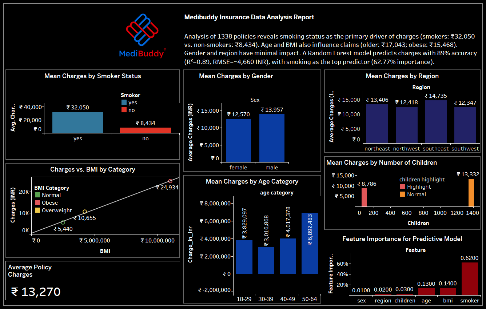

# Medibuddy Insurance Data Analysis Project

This repository contains my data analysis project completed during my internship at LabMentix. The project analyzes 1338 insurance policies to identify factors influencing claims and predict charges using machine learning.

## Project Overview
- **Objective**: Analyze insurance data to provide insights for policy pricing and predict charges.
- **Tools Used**: Tableau Desktop, Python (scikit-learn), MySQL.
- **Key Findings**:
  - Smokers average ₹32K in claims vs. ₹8.4K for non-smokers.
  - BMI and age significantly impact claims, while gender and region do not.
  - Random Forest model predicts charges with R²=0.89, RMSE=4,660 INR (smoking: 62.77% importance).
- **Recommendation**: Implement BMI-based discounts for tailored pricing.

## Files
- `merged_data.twbx`: Tableau workbook with dashboard (questions 1-8, feature importance).
- `Medibuddy_Dashboard.pdf`: PDF export of the dashboard.
- `Medibuddy_Dashboard.png`: Image of the dashboard.
- `medibuddy_ml.py`: Python script for Random Forest model.
- `feature_importance.csv`: Feature importance from ML model.
- `predictions.csv`: Actual vs. predicted charges.
- `ML_Model_Output.txt`: Model performance and feature importance output.
- `merged_data.csv`: Original dataset (also in `.twbx`).

## How to View
- Open `merged_data.twbx` in Tableau Desktop to explore the dashboard.
- Run `medibuddy_ml.py` in Python to reproduce the Random Forest model (requires pandas, scikit-learn).

## Screenshots

## Contact
Connect with me on [LinkedIn](insert-your-linkedin-url) for more details!
